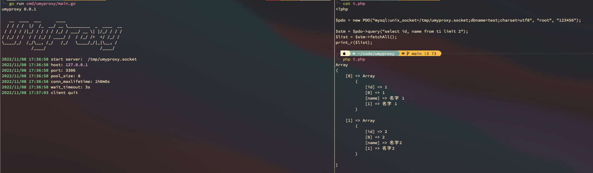

# umyproxy


`umyproxy` 是一个 mysql 的本地代理服务程序。
可以为基于 php-fpm 的 PHP 程序提供 mysql 连接池的功能, 解决高并发中短连接产生大量 `TIME_WAIT` 的问题。

`umyproxy` 使用 `Unix domain socket` 与客户端进行通信, 第一次与 mysql 服务端建立连接, 代理 client 端进行通信，认证通过后复用连接并放入连接池。
client 端第二次连接时采用假的认证方式认证。

## 特点

- 支持 mysql 连接池。
- 纯 go 语言开发, 不依赖第三方库。
- 使用 Unix domain socket 通信。
- 使用简单，不需要配置 mysql 账号密码。

## 使用

> laravel 框架为例

1. 启动服务

```
./umyproxy -host 127.0.0.1 -port 3306 -socket /tmp/umyproxy.socket
```

2. 配置数据库

修改数据库配置： ./config/database.php

mysql 配置增加

```
'unix_socket' => '/tmp/umyproxy.socket',
```

## 查看帮助

```
./umyproxy -h
```

## 编译

```
./build
```

## demo




## laravel 使用

[https://github.com/lyuangg/laravel-umyproxy](https://github.com/lyuangg/laravel-umyproxy)
